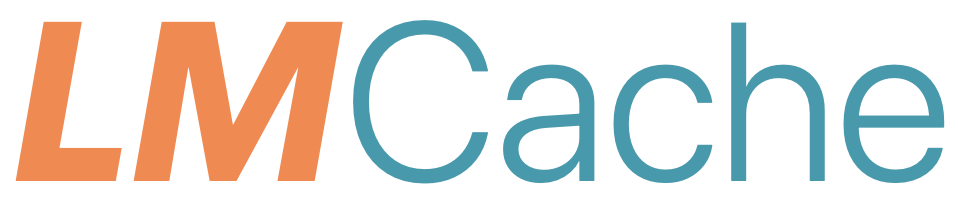

# : A CDN for Fast RAG with Composable Knowledge

**LMCache team**

**TL; DR:** Trubocharging vLLM with 7x faster access with 100x more KV caches.

Large Language Models (LLMs) have become ubiquitous across industries, but when using LLMs together with long documents, it takes forever for the first token to come out. Here comes LMCache, a novel system developed in UChicago that allows the first token to come out ??x faster by efficiently managing long documents (and other sources of knowledge) for you.

## What is LMCache?

No matter how smart LLMs become, they will still need to read new texts and other external data, but doing so is very slow and costly.  
LMCache drastically reduces this cost by letting LLMs read each text only once. By storing the KV caches (the LLM-usable representation) of all reusable texts, LMCache can reuse the KV caches of any reused text (not necessarily the prefix) in any serving engine instance. By combining LMCache with vLLM, LMCache reduces time to the first token (TTFT) by 3-10x and saves the GPU cycle reduction in many LLM use cases, including multi-round QA and RAG.

Developed at UChicago, this solution is already gaining significant interest from industry partners.

